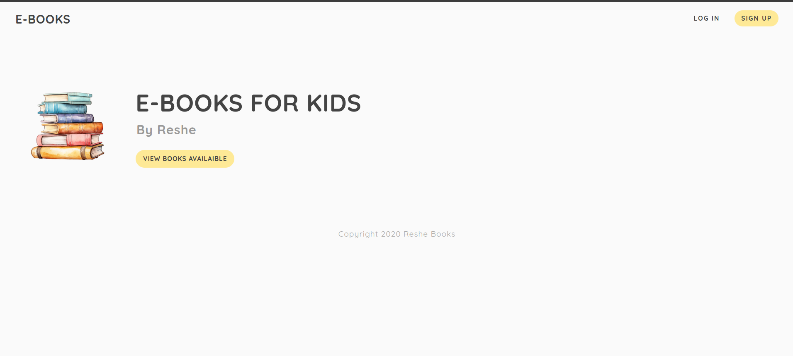
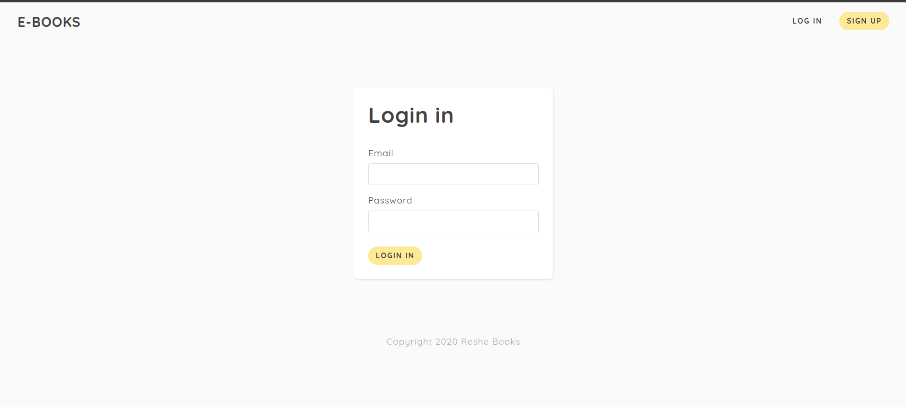
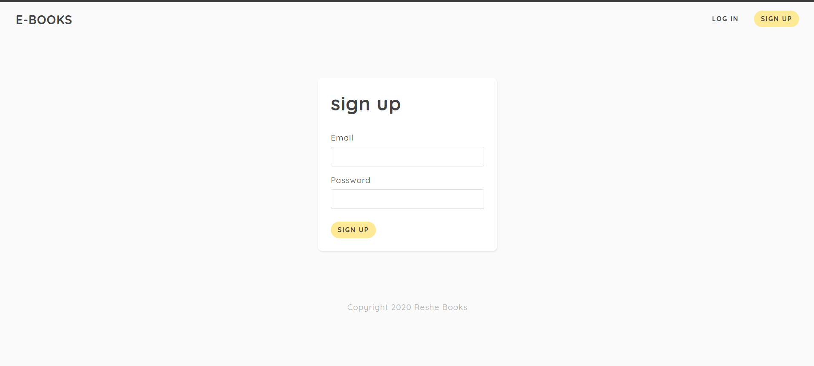

# Node Authentication system

Introducing an authentication system built with Node.js Express.js, where users can securely create accounts and log in to explore the application's features.

## Installation

1. Clone the project and run on terminal : nodemon app to start running the project .
2. Ensure that the database is running on MongoDB using this link.: https://cloud.mongodb.com/v2/66238e6d1c2a08387c59045f#/overview .
==> (NB : You must have a MongoDB account and create your database, then connect it with the application). 
3-If both steps 1 and 2 are completed successfully, you can access the application via the provided link: http://localhost:3005/.

## Technologies Used:

- [Node.js] : Node.js is a popular open-source, cross-platform JavaScript runtime environment that allows developers to execute JavaScript code server-side
- [Express.js] :Express.js is a minimalistic and flexible web application framework for Node.js, designed to build web applications and APIs quickly and easily. It provides a robust set of features for web and mobile applications, including routing, middleware support, template engines, and much more.
- [MongoDB] : MongoDB is a popular open-source, NoSQL (non-relational) database management system designed for modern application development. It stores data in flexible, JSON-like documents, making it easy to work with and scale for a wide range of use cases.)
- [Ejs] : or Embedded JavaScript, is a simple templating language that lets you generate HTML markup with plain JavaScript. It's often used with Node.js and Express.js to generate dynamic HTML content on the server-side.

## Screens :

